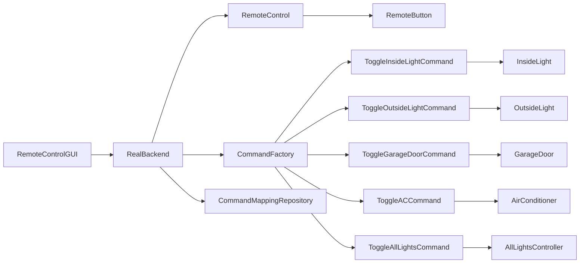
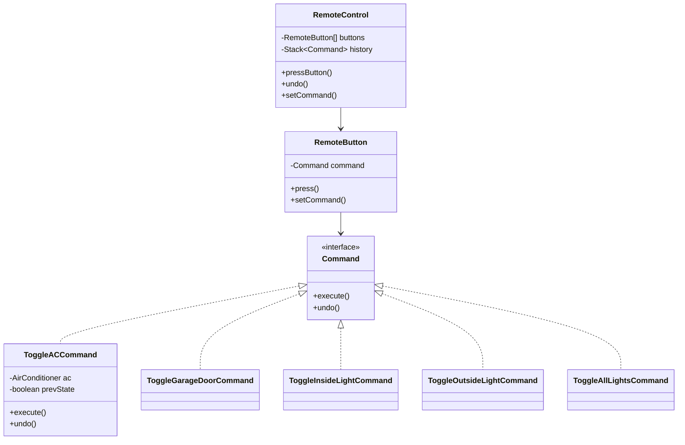
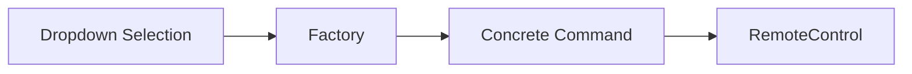
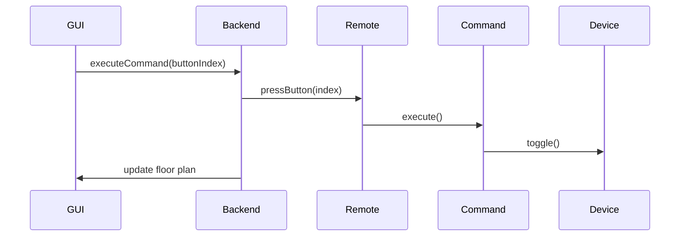

# Programmable Remote Control System

A full-stack OOP showcase using Command Pattern, Factory Pattern, GUI MVC separation, and stateful device simulation

This project implements a programmable smart‑home remote control system using Java, Swing, and several classic Object‑Oriented Design Patterns. It demonstrates encapsulation, abstraction, polymorphism, inheritance, composition, inversion of control, and clean separation of concerns.

The system includes:

- A GUI remote control with 14 buttons
- A floorplan visualization panel
- A Command Pattern–based backend
- A Factory for dynamic command creation
- A JSON-based persistence layer
- Full undo support
- Reset-to-factory-default behavior

## Key OOP Concepts Demonstrated

### Encapsulation

Each device (AC, GarageDoor, InsideLight, OutsideLight) encapsulates its own state and exposes only meaningful operations (toggle(), setState(), isOn()).

### Abstraction

The Command interface abstracts all executable actions.
The GUI never knows how a device works — only that a command can be executed or undone.

### Polymorphism

Every concrete command (ToggleACCommand, ToggleGarageDoorCommand, etc.) implements the same Command interface.
The remote control treats them uniformly.

### Composition

Commands hold references to devices.
The remote control holds an array of RemoteButton objects.
The backend composes devices, factory, repository, and remote.

### Factory Pattern

CommandFactory converts string names into actual command objects — enabling dynamic assignment from GUI dropdowns.

### Command Pattern

The core of the system.
Each button press triggers a Command.execute(), and undo triggers Command.undo().

### Separation of Concerns

- UI Layer - RemoteControlGUI, FloorPlanPanel
- Backend Controller - RealBackend
- Invoker - RemoteControl, RemoteButton
- Commands - command package
- Receivers (Devices) - devices package
- Persistence - CommandMappingRepository

## High-Level Architecture



## Command Pattern Breakdown

Command Interface

```java
public interface Command {
    void execute();
    void undo();
}
```

Every action in the system is a Command.

This gives us:

- Uniform execution
- Uniform undo
- Decoupling between UI and devices
- Extensibility (new commands require no changes to existing code)

## Class Relationships (UML)



## Factory Pattern

The CommandFactory converts string identifiers into actual command objects.

This enables:

- Dynamic assignment from GUI dropdowns
- Loading mappings from JSON
- Resetting to factory defaults
- Adding new commands without touching UI or backend logic



##️ Persistence Layer
CommandMappingRepository loads and saves button --- command mappings using JSON files:

- factory.json --- default mappings
- mapping.json --- user saved mappings

This demonstrates:

- File I/O
- JSON parsing
- Decoupling persistence from logic
- Clean separation of concerns

## GUI Architecture

The GUI implementation is intentionally kept simple — it delegates all logic to the backend.



## Undo Mechanism

Undo is implemented using a stack of executed commands.

- Every time a command executes, it is pushed onto the stack.
- Undo pops the last command and calls undo().

## Floor Plan Visualization

The FloorPlanPanel uses Swing drawing primitives to visually represent:

- AC state
- Garage door state
- Indoor light
- Outdoor light

The backend updates the panel after every command.

## Extending the System

To add a new device:

- Create a new device class
- Create a new command class implementing Command
- Add a case in CommandFactory
- Add the option to the GUI dropdown

No other code changes required due to polymorphism + factory + decoupled UI.

## Testing

This project includes JUnit 5 tests for core components:

- Device state behavior (e.g., `AirConditioner`, `InsideLight`)
- Command pattern behavior (`ToggleACCommand`, `ToggleInsideLightCommand`, etc.)
- Invoker behavior (`RemoteControl` with history/undo)
- Factory behavior (`CommandFactory` mapping names to concrete commands)

Tests can be run directly from IntelliJ (JUnit run configuration) or via Maven:

```bash
mvn test
```
